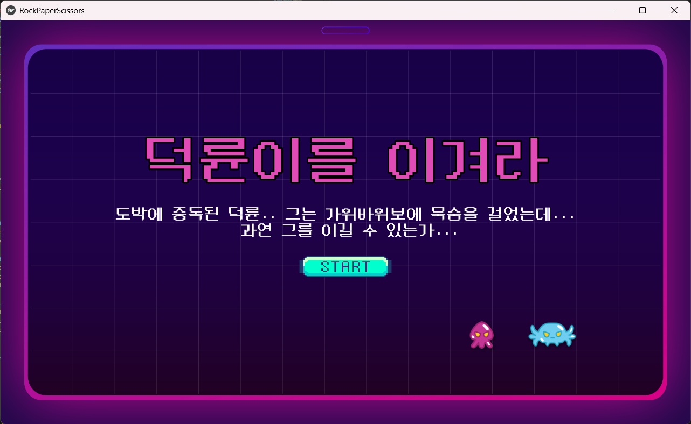

# 덕륜이를 이겨라
- 덕륜(컴퓨터)이와 가위바위보(✌️✊✋) 하자!
- 10라운드동안 가위바위보를 진행하며, 승리 시 반응 속도를 기반으로 점수를 측정한다.
- 빠를 수록 높은 점수를 받으며, score에 따라 본인의 `반응속도 나이`를 알 수 있다.
 
### 게임 소개

### 구현
#### 적용값
    - multiprocessing 으로 frame_queue에 frame을 담아두고, image processing 으로 action_queue 에 inference 값 담아둠. (이를 process 간 공유 변수 (Queue, List)를 지정하여 공유 )
    - model load 및 inference GPU로 적용 해야함 (현재 CPU Multiprocessing)
    - threshold = 0.65 (확률 65% 적용)
    - count_win = 10 (10 frame cnt -> state 변경)
    - round 총 10라운드 적용 (5라운드는 조금 적은 듯)
    - sound 미적용 (BGM 및 Effect sound 찾아보기) -> 추후 변경
    - 개발자의 의도 (미리 예측하여 사용자가 내고 있다면, (근데 그 값이 컴퓨터를 이길 값이라면) 컴퓨터 값 변경)

#### 결과값 도출

    - cal_result 함수로 계산 (UI 적용 전까지는 print문으로 출력)

 timing_list = [100,300, 400, 500, 600 ,700 ,800, 1000]
 age_list = ['신','10대','20대','30대','40대','50대','60대','70대','다시']
 score_list = [100, 90, 80, 70, 60, 50, 40,30,0]

#### 데이터
- 수집
    - 데이터 수집 주기: 2fps
    - frame shape: (480,640,3)
    - 배경, 손 및 촬영 각도 변화
- 데이터
    - Dataset1 (original)
        ||train|val|test|total|
        |---|---|---|---|---|
        |rock|544|181|182|907|
        |scissors|541|180|182|903|
        |paper|544|181|182|907|
        |total|1629|542|546|2717|
        
        ori_data : train:0.7 / val: 0.15 / test:0.15

    - Dataset2 (original + custom)
        ||train|val|test|total|
        |---|---|---|---|---|
        |rock|1071|281|284|1636|
        |scissors|1549|440|443|2432|
        |paper|1020|264|267|1551|
        |total|3640|985|994|5619|
    
        new_data:  train:0.6 / val: 0.2 / test:0.2

#### 학습

|Exp. Name|F1-score|Accuracy|Confusion matrix|
|---|---|---|---|
|MobileNetV3A_CE_baseline|0.9690|97.08%|[[283   1   0][  0 443   0][  6  22 239]]|
|MobileNetV3A_RP_Hard_LossAll|0.9946|99.50%|[[283   1   0][  0 442   1][  2   1 264]]|

#### 게임 로직
컴퓨터가 랜덤으로 가위, 바위, 보를 생성
사용자는 승리할 수 있는 수를 내며, 학습된 모델이 손을 인식
빠를 수록 높은 점수를 받으며, 점수에 따라 반응 속도 나이를 측정
